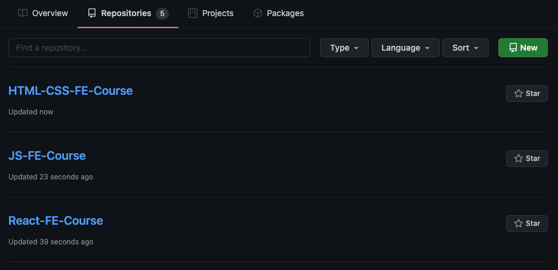

# Front End/JavaScript Developers Course 2021/2022

__JavaScript__ - is one of the most popular and cross-platform programming languages that allows you to work with both web interfaces and back-end and mobile clients.

Our training focuses on current __JavaScript__ approaches, technologies and tools. You will learn about the latest trends in web development, gain practical skills and experience for working on real projects, as well as get acquainted with the architecture and structure of web applications.

__The aim of the course__ - is to gain knowledge and experience sufficient for employment for the position of *Junior Software Engineer* in the field of *Front-end / JavaScript*.

## You will learn:
#### Html:
- Syntax
- Text elements (paragraphs, links, lists, tables)
- Media elements (images)
- The structure of the HTML document (semantics)
- Work with forms (HTML only)
#### CSS:
- Attaching CSS
- Selectors (specificity, cascading, inheritance)
- Text styles, fonts
- Units
- Background, images in CSS
- Box model
#### JavaScript:
- Fundamentals of language
- Advanced working with functions
- Objects, Classes, Inheritance, Prototypes
- Asynchronous
- Events
- Handling Errors, Debugging, Profiling
#### React:
- Core concepts
- Webpack
- Components
- Hooks
- Redux
- Forms
- Routing
- Unit testing
- Patterns, tips & tricks

## The next step:
Is an internship in the laboratory, where you can deepen the knowledge gained and apply it while developing your own projects under the guidance of experienced developers. 

## How our approach differs from others:
We do not have a deadline for the course. You can complete the course at the speed that suits you more (you can complete it faster; move along the program on your own).

###### Based on the results of successful training, you will have a chance to receive a Job Offer at the EPAM office in Grodno for the position of Junior Front-End Engineer.

## Requirements for candidates:
- English level from A2 + / B1 (Intermediate) and above
- Basic knowledge of HTML / CSS / JS

## Good to know:
- Skills of creating a website with images, links, CSS and scripts
- Experience in using any OOP programming language
- Theoretical knowledge of data structures
- Strong knowledge of basic algorithms

## For whom this training:
- University graduates (no distribution restrictions)
- 3-4 year students
- Professionals who want to change their profession

## These articles will help you improve your English language skills:
- [Test Your English in 7 minutes: Quick English Test](https://training.by/#!/News/328)
- [Improving your English with audiobooks: what, when, and how to listen to?](https://training.by/#!/News/313)
- [English Self-Study Materials](https://training.by/#!/News/203)
- [English for adults: solving most frequent issues](https://training.by/#!/News/180)

## JavaScrip:
- [The Modern JavaScript Tutorial](https://javascript.info/)
-------
# Our Main modules:
1. [HTML Basics](https://github.com/Front-Grodno/Front-Grodno-JS-course-2021/tree/master/modules/html)
1. [CSS Basics](https://github.com/Front-Grodno/Front-Grodno-JS-course-2021/tree/master/modules/css)
1. [JS Basics](https://github.com/Front-Grodno/Front-Grodno-JS-course-2021/tree/master/modules/js)

# How to deal with tasks in our course:
Create 3 repository at [github.com](https://github.com/) and push each task in a separate commit
    1. HTML/CSS
    1. JS
    1. React

