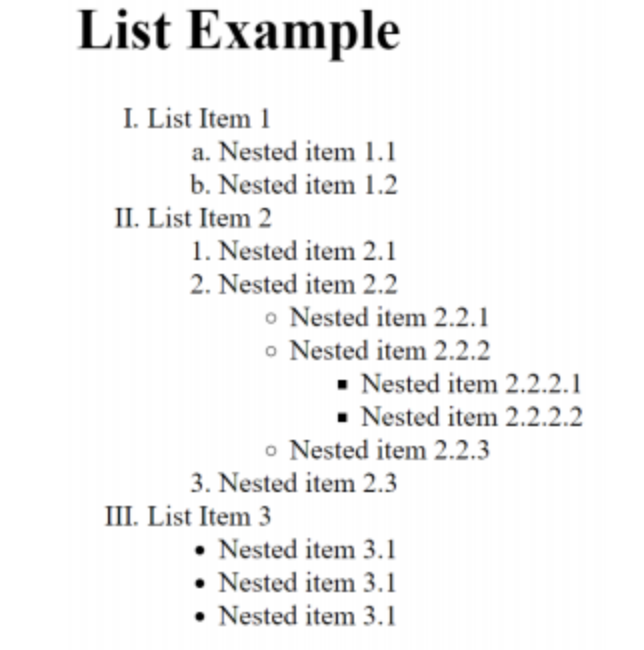
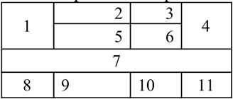
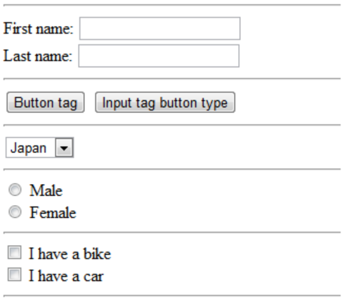

# HTML Basics
## In the current module we should:
Get familiar with the basics of HTML:
- Syntax
- Text elements (paragraphs, links, lists, tables)
- Media elements (images)
- The structure of the HTML document (semantics)
- Work with forms (HTML only)

## Theory
1. You need to study sections from 1 to 8 of the course **["HTML И CSS — ОСНОВЫ ВЕБ-ПРОГРАММИРОВАНИЯ"](https://codebra.ru/ru/courses/html-css-base)**

## Practice
*Task 1.* Create an HTML file with following list:

*Task 2.* Create an HTML file with following table:

*Task 3.* Create an HTML file with following form:

*Task 4.* Create an HTML file with an embedded YouTube video using an iframe.

## Control questions
1. Hypertext. HTML language. HTML standards. The structure of the HTML document.
2. The concept of HTML tag and attributes tags.
3. <! DOCTYPE> declaration. The difference between the types of documents.
4. Tags of logical and physical text formatting.
5. Types of HTML lists. Attributes of the list.
6. Images and links in HTML.
7. HTML tables.
8. Meta-tag HTML.

## Additional materials
1. interactive course https://ru.code-basics.com/languages/html
2. https://webref.ru/course/html-basics
3. https://webref.ru/course/html-content
4. https://webref.ru/course/html-tutorial
5. https://webref.ru/course/section
6. https://webref.ru/course/html5-form
