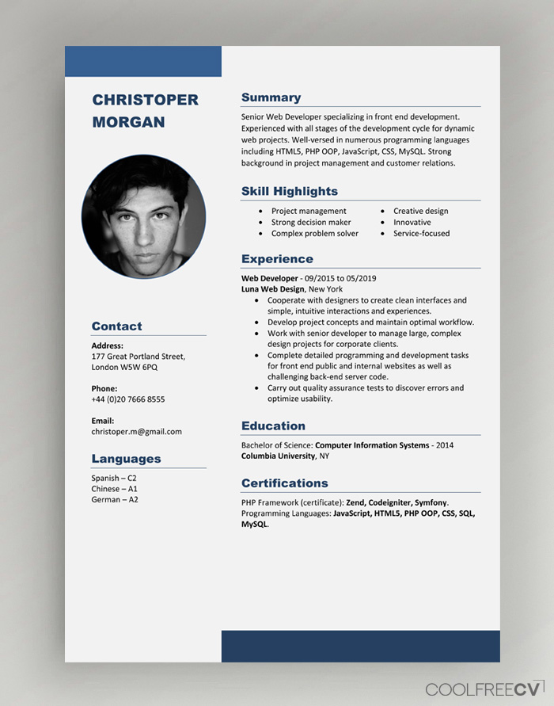

# HTML Basics
## In the current module we should:
Get familiar with the basics of HTML:
- Syntax
- Text elements (paragraphs, links, lists, tables)
- Media elements (images)
- The structure of the HTML document (semantics)
- Work with forms (HTML only)

## Theory
  You need to pass interactive course https://ru.code-basics.com/languages/html

    Topics with questions:
    1. HTML basics
        a. Hypertext.
        b. HTML language.
        c. HTML standards.
        d. The structure of the HTML document.
        e. The concept of HTML tag and attributes tags.
        f. <! DOCTYPE> declaration. The difference between the types of documents.
    2. Text in the HTML
        a. Tags of logical and physical text formatting.
        b. Types of HTML lists. Attributes of the list.
        c. HTML tables.
    3. Media
        a. Images in HTML.
        b. What new added since HTML5?
    4. Structure of HTML document
        a. Links in HTML.
        b. Meta-tag HTML.
        c. Block and inline elements.
    5. Semantic layout
        a. What is it?
        b. Describe few semantic elements.
    6. Forms in HTML
        a. How we can use forms?
        b. Elements of form.
        c. Submit form.

## Practice
*Task.* Create an HTML file with your own CV. A CV or resume is a document that a job seeker provides to a potential employer when nominating for an open vacancy.

CV should be on English and should include:
1. First name and Last Name
2. Contacts, Photo
3. Short info about you (your goal and priorities, highlight your strengths, tell us about your work experience, if there is no work experience, tell us about your aspiration and ability to learn quickly and learn new things)
4. Skills (programming languages, frameworks, methodologies, version control systems, and development tools that you own)
5. Code examples
6. Experience
7. Education (including courses, seminars, lectures, online training)
8. English (level and courses)

Technical requirements for CV:
1. Use semantic tags
2. Use [HTML validator](https://validator.w3.org/) to validate HTML
3. Use [GitHub Pages](https://pages.github.com/) for deploy

CV examples (please use as an example, do not copy)

    
    
    

## Additional materials
1. sections from 1 to 8 (without subscription) of the course ["HTML И CSS — ОСНОВЫ ВЕБ-ПРОГРАММИРОВАНИЯ"](https://codebra.ru/ru/courses/html-css-base)
2. https://webref.ru/course/html-basics
3. https://webref.ru/course/html-content
4. https://webref.ru/course/html-tutorial
5. https://webref.ru/course/section
6. https://webref.ru/course/html5-form
